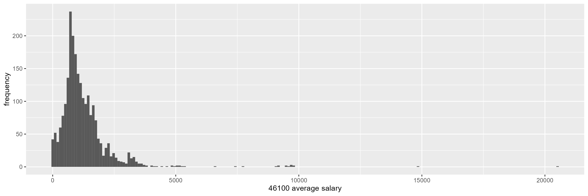
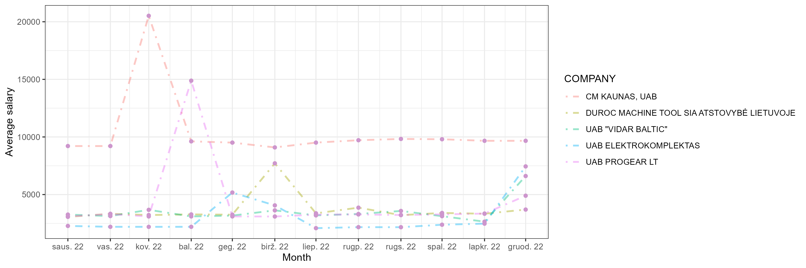
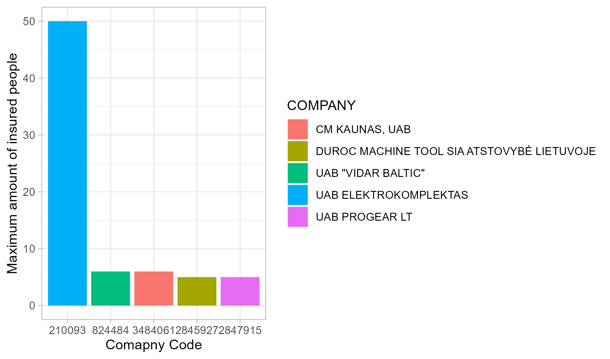
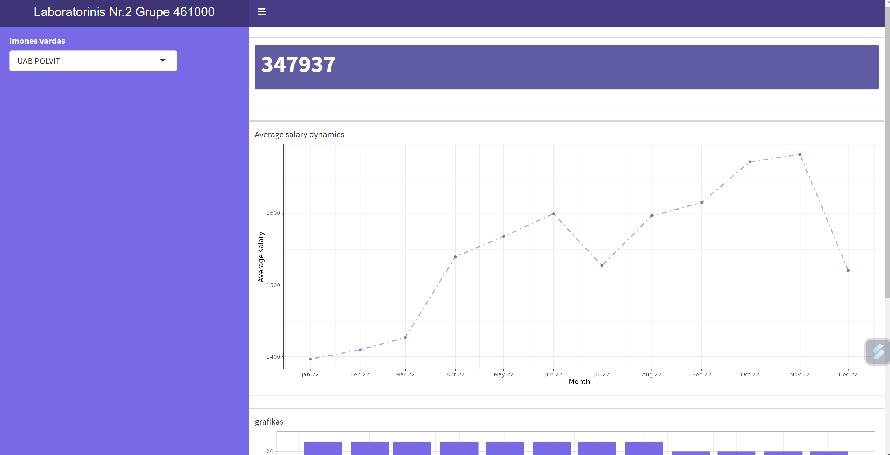

# R Laboratorinis darbas: duomenų vizualizacija

| Variantas | ecoActCode |
| ------------- | ------------- |
| 6    | 461000 |

### 1. Užduotis

Atsakymas:

#Išvados:

Iš gautos histogramos matome, kad tiriamoje ekonominėje grupėje daugiausiai vyrauja atlyginimai iki 2600 eirų. Daugiausiai įmonėse yra mokami atlyginimai apie 1300 eurų. Taip pat vertą paminėti, kad duomenims yra būdingas nurmalusis pasiskirstymas su nežymiomis išskirtimis.

### 2. Užduotis

Atsakymas:

#Išvados: 
Išfiltravus duomenis gavome, kad didžiausias atlyginimas 2022 m. tyriamoje ekonominėje grupėje buvo mokamas UAB "CM Kaunas", kurioje vidutinis atlygis buvo apie 10000 eurų (Lietuvos padalinyhe dirba 5 darbuotojai, brokeriai), kitose keturiose įmonėse atlyginimai buvo panašūs iki 3000 eurų, taip pat verta paminėti, kad šiose įmonėse atlygimas iškilo gruodžio mėnesį, ką galėjo įtakoti metinės kalėdinės išmokos (bonusai).

### 3. Užduotis

Atsakymas:

#Išvados:

Daugiausiai apdraustų darbuotojų yra ELEKTROKOMPLEKTAS: 50 darbuotojų, o visose kitose šmonėse yra apdrausti po 6 ir 5 darbuotojus

### 4. Užduotis

Shiny R aplikacijos nuotrauka:

